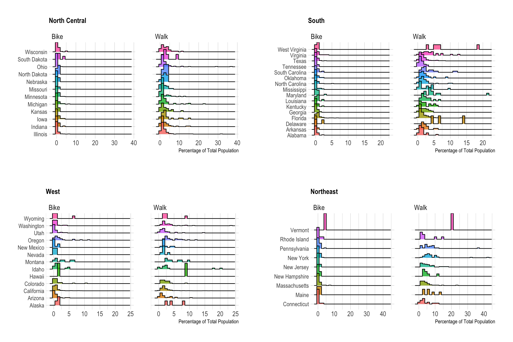

Bike & Walk Commutes
================
Jamie Hargreaves

``` r
library(tidyverse)
library(ggridges)
library(hrbrthemes)
library(gridExtra)

# read data
commute_mode <- readr::read_csv("https://raw.githubusercontent.com/rfordatascience/tidytuesday/master/data/2019/2019-11-05/commute.csv")

# get the US regions and remove missing observations
regions <- commute_mode %>%
  filter(!is.na(state_region)) %>%
  distinct(state_region) %>%
  pull()

# use purrr::map to create a plot of each region
plots <- map(
  
  # pass regions
  regions,
  
  # create a function to plot a ridge plot for a given state region
  function(x){
    
    # filter the state region
    commute_mode %>%
      filter(state_region == x) %>%
      
      # start plotting
      ggplot(aes(x = percent, y = state, fill = state)) + 
      geom_density_ridges(alpha = 0.8, stat = "binline", show.legend = FALSE) + 
      facet_wrap(. ~ mode) + 
      
      # pass the state region as the plot title
      labs(
        title = x,
        x = "Percentage of Total Population",
        y = NULL
      ) +
      
      # change theme settings 
      theme_ipsum() + 
      theme(
        plot.title = element_text(size = 12),
        axis.text.y = element_text(size = 10)
      )
  }
)

# plot each state region
do.call(grid.arrange, plots)
```


